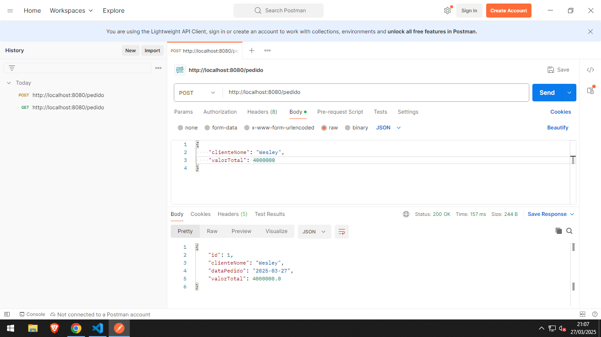
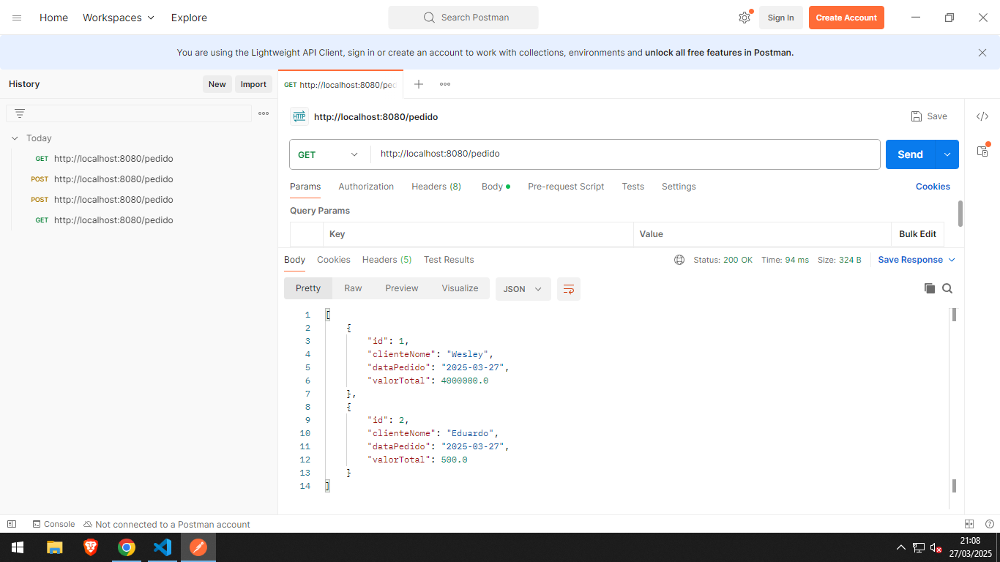
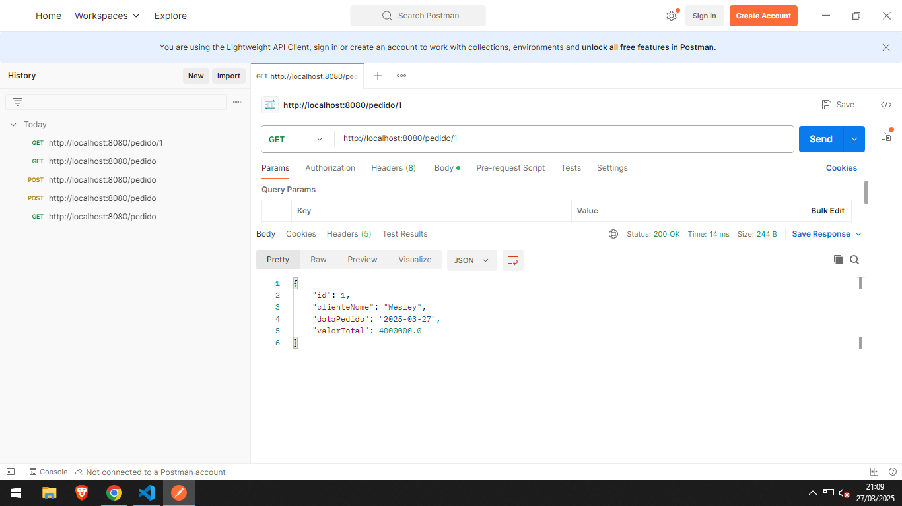
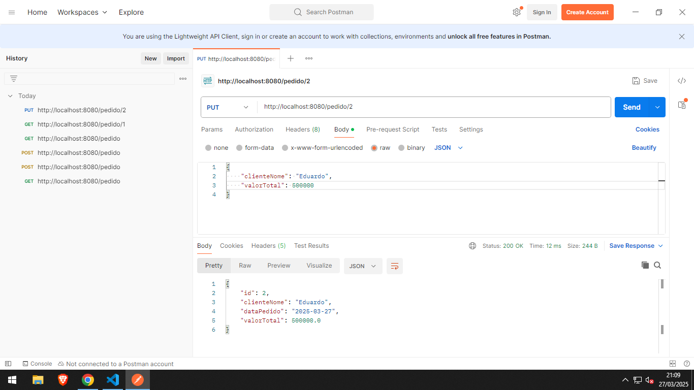
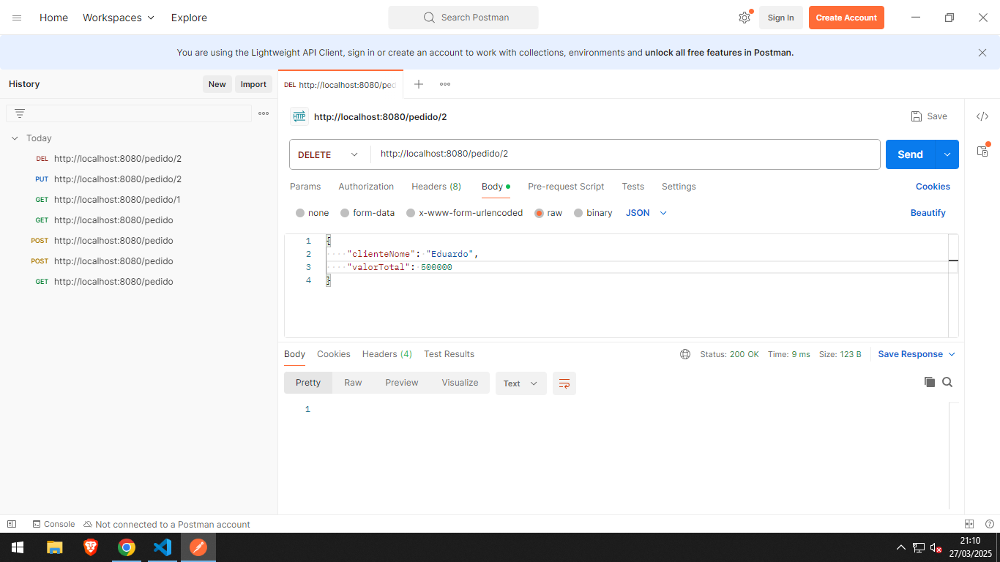
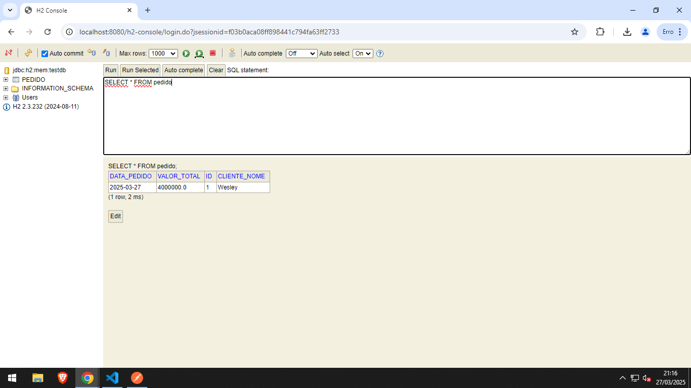

# API - API SpringBoot de Pedidos (Checkpoint 01)

API REST para gerenciamento de pedidos.

## Owner

 - Wesley Souza de Oliveira (RM97874)

## 📦 Endpoints

### ➕ Criar um novo pedido

**POST** `/pedido`

Cria um novo pedido com data atual (a data será preenchida automaticamente pelo sistema).

#### 🔸 Requisição

```json
{
  "clienteNome": "Wesley",
  "valorTotal": 4000000
}

{
  "clienteNome": "Eduardo",
  "valorTotal": 500
}
```

#### ✅ Resposta (201 Created)

```json
{
  "id": 1,
  "clienteNome": "Wesley",
  "dataPedido": "2025-03-27",
  "valorTotal": 4000000.0
}

{
  "id": 2,
  "clienteNome": "Eduardo",
  "dataPedido": "2025-03-27",
  "valorTotal": 500.0
}
```

---

### 📋 Listar todos os pedidos

**GET** `/pedido`

Retorna a lista de todos os pedidos cadastrados.

#### ✅ Resposta

```json
[
    {
    "id": 1,
    "clienteNome": "Wesley",
    "dataPedido": "2025-03-27",
    "valorTotal": 4000000.0
    },

    {
  "id": 2,
  "clienteNome": "Eduardo",
  "dataPedido": "2025-03-27",
  "valorTotal": 500.0
    }
]
```

---

### 🔍 Buscar pedido por ID

**GET** `/pedido/{id}`

#### ✅ Resposta

```json
{
    "id": 1,
    "clienteNome": "Wesley",
    "dataPedido": "2025-03-27",
    "valorTotal": 4000000.0
}
```

---

### ✏️ Atualizar um pedido

**PUT** `/pedido/{id}`

Atualiza o nome do cliente ou valor total de um pedido existente. A data do pedido **não é alterada**.

#### 🔸 Requisição

```json
{
  "clienteNome": "Eduardo",
  "valorTotal": 500000.0
}
```

#### ✅ Resposta

```json
{
  "id": 1,
  "clienteNome": "Eduardo",
  "dataPedido": "2025-03-27",
  "valorTotal": 500000.0
}
```

---

### 🗑️ Deletar um pedido

**DELETE** `/pedido/{id}`

Remove o pedido com o ID especificado.

#### ✅ Resposta

- Status: `204 No Content`

---

## ⚠️ Validações

- `clienteNome` é obrigatório.
- `valorTotal` não pode ser negativo.
- `dataPedido` é gerado automaticamente e não pode ser informado manualmente.


---

## 🧱 Estrutura do Projeto

### 📂 Model
**`Pedido.java`**  
Contém a definição da entidade `Pedido`, que representa a tabela no banco de dados. Inclui os campos:
- `id`: identificador único do pedido (gerado automaticamente).
- `clienteNome`: nome do cliente (obrigatório).
- `valorTotal`: valor do pedido (não pode ser negativo).
- `dataPedido`: data em que o pedido foi criado (definida com a data atual automaticamente pelo sistema).

### 📂 Repository
**`PedidoRepository.java`**  
Interface que estende `JpaRepository`. Fornece métodos prontos para realizar operações no banco de dados como:
- `findAll()`
- `findById(id)`
- `save(pedido)`
- `deleteById(id)`

### 📂 Service
**`PedidoService.java`**  
Contém a lógica de negócio da aplicação. Interage com o `PedidoRepository` e encapsula chamadas ao banco de dados:
- Listagem de todos os pedidos
- Busca por ID
- Criação e atualização
- Exclusão

### 📂 Controller
**`PedidoController.java`**  
Exposição dos endpoints REST da API para o mundo externo (via HTTP). Recebe e responde requisições como:
- `GET /pedido`
- `GET /pedidos/{id}`
- `POST /pedido`
- `PUT /pedido/{id}`
- `DELETE /pedido/{id}`

Chama a camada de `Service` para processar os dados e retorna os resultados como JSON.


---


## 📸 Exemplos de Requisições no Insomnia

1. Criar um novo pedido.
    
2. Buscar todos os pedidos.
    
3. Buscar um pedido pelo ID.
    
4. Atualizar um pedido.
    
5. Deletar um pedido.
    
6. H2 - Console.
    

---


## Passos Para Executar o Projeto

### Visualize o Terminal

- `Execute o comendo 'ls' para verificar o diretório que você está` 
- `Caso necessário, execute o comando 'cd (nome-pasta)'` 
- `Verifique se você tem o java instalado na sua máquina: java --version`
- `Verifique se você tem o maven instalado na sua máquina: mvn --version`
- `Execute a API executando o comando: mvn spring-boot:run`